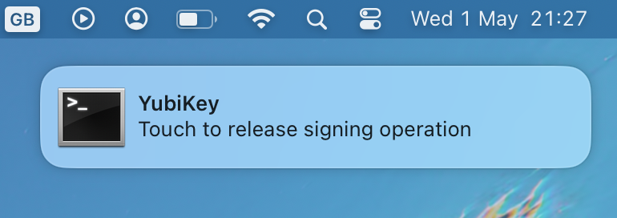
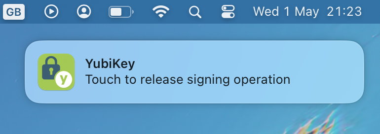

# yubikey-gpg-notifier

This tool creates notifications when it detects gpg operations are waiting for a YubiKey touch.

It acts as a proxy between gpg and scdaemon and watches for certain commands being passed to the YubiKey.

When it detects one of these commands and the YubiKey has not responded for a configured period of time, a notification is shown to remind the user to touch the key.

## Installation

1. Clone this repository to your machine.

2. Run `pip install <repository path>`

3. Get the path to the installed script with `which yubikey-gpg-notifier`

3. Add the line `scdaemon-program <path to yubikey-gpg-notifier>` to `~/.gnupg/gpg-agent.conf`

4. Create a config file at `~/.config/yubikey-gpg-notifier.json` - the tool will refuse to start without this.
The `scdaemon` path can be retrieved by running `gpgconf`.
Example using [terminal-notifier](https://github.com/julienXX/terminal-notifier):
```json
{
    "scdaemon": "/path/to/gnupg/libexec/scdaemon",
    "notify_command": "terminal-notifier -group yubikey-gpg-notifier -title YubiKey -message 'Touch to release %operation operation'",
    "cancel_command": "terminal-notifier -remove yubikey-gpg-notifier",
    "auth_wait_time": 0.2,
    "sign_wait_time": 0.2,
    "decrypt_wait_time": 0.2
}
```

5. It may be necessary on first run and on config changes to restart the gpg-agent process:
```shell
gpgconf --kill gpg-agent
gpgconf --launch gpg-agent
```

## Configuration

Configuration is loaded from `~/.config/yubikey-gpg-notifier.json` and must be present and complete for the tool to start.

Options:
- `notify_command` - a shell command to run when a touch event is detected. `$description` will be replaced with a description of the current operation.
- `cancel_command` - a shell command to run when the end of a touch event is detected.
- `scdaemon` - the location of the scdaemon executable, can be retrieved with `gpgconf`.
- `auth_wait_time`, `sign_wait_time`, `decrypt_wait_time` - the length of time a smart card operation has to block before it is considered a touch event. Raise this if you are seeing notifications when a touch is not needed.
- `log_level` (optional) - the [level](https://docs.python.org/3/library/logging.html#levels) of logging to output. Defaults to `info`.
> [!WARNING]
> When raising the log level to debug, communication between the smart card and daemon is logged. This can include PINs and other sensitive data.

## Configuration examples

Using terminal-notifier:
```json
{
    "scdaemon": "/path/to/gnupg/libexec/scdaemon",
    "notify_command": "terminal-notifier -group yubikey-gpg-notifier -title YubiKey -message 'Touch to release %operation operation'",
    "cancel_command": "terminal-notifier -remove yubikey-gpg-notifier",
    "auth_wait_time": 0.2,
    "sign_wait_time": 0.2,
    "decrypt_wait_time": 0.2
}
```


---

Using terminal-notifier, masquerading as Yubico Authenticator:
```json
{
    "scdaemon": "/path/to/gnupg/libexec/scdaemon",
    "notify_command": "terminal-notifier -group yubikey-gpg-notifier -sender com.yubico.yubioath -title YubiKey -message 'Touch to release %operation operation'",
    "cancel_command": "terminal-notifier -remove yubikey-gpg-notifier -sender com.yubico.yubioath",
    "auth_wait_time": 0.2,
    "sign_wait_time": 0.2,
    "decrypt_wait_time": 0.2
}
```


---

Using libnotify's notify-send:
```json
{
    "scdaemon": "/path/to/gnupg/libexec/scdaemon",
    "notify_command": "notify-send --transient YubiKey 'Touch to release %operation operation'",
    "cancel_command": "",
    "auth_wait_time": 0.2,
    "sign_wait_time": 0.2,
    "decrypt_wait_time": 0.2
}
```


## Troubleshooting

Logs are written to `/tmp/yubikey-gpg-notifier.log`.

If running the tool directly to check for errors, it is necessary to pass the argument `--multi-server` as all arguments are passed to scdaemon. Without this scdaemon will fail to start.

## Links

Inspired by:
- https://github.com/klali/scdaemon-proxy
- https://github.com/maximbaz/yubikey-touch-detector
- https://github.com/palantir/gpg-tap-notifier-macos
